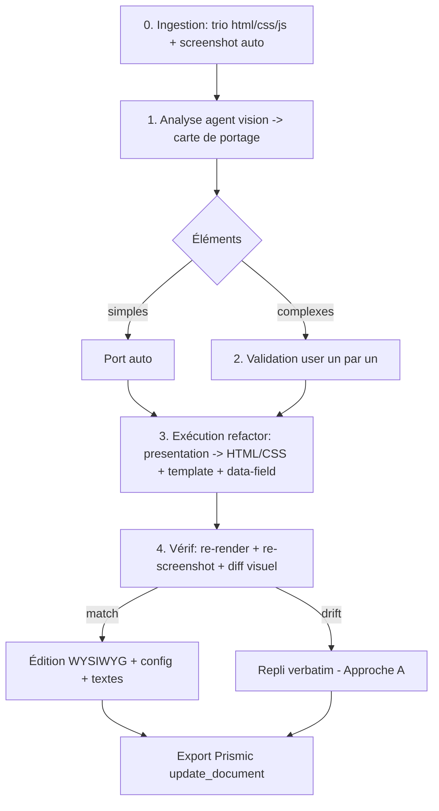

# Portage des slices legacy JS-lourdes — Design

Date : 2026-09-01
Statut : design approuvé (Approche A + moteur de séparation vérifié). À implémenter par phases.

## 1. Problème

EkwaSlice édite du **DOM statique** : hover/select/styles inline sur de vrais éléments. Or beaucoup de slices Prismic existantes ont leur **contenu construit par JS au runtime** (à tort). Dans le canvas, le JS est inerte (`text/ekw-js`) → le canvas voit une coquille vide, rien à sélectionner/éditer. Le contenu n'apparaît que dans l'aperçu (iframe qui exécute le JS).

L'import actuel (`importCode` / `flattenCssToInline`, « aplatir en inline ») traite toute slice comme du statique → **destructeur** pour les slices riches (il scope/inline une CSS faite pour rester telle quelle) et **impuissant** face au contenu généré par JS.

Objectif : rendre **fiable** l'import → édition → export (round-trip Prismic) de ces slices, en rendant *le travail dessus* possible, pas seulement l'affichage.

## 2. Slice de référence (cas d'école)

Prismic doc `aamJGhAAACQALA7F` « [Custom slice] Carte interactive petits producteurs », repo `ekwateur-edito`, custom_type `custom_slice` (champs `html_only`, `css`, `js`, `html` — ici tout est entassé dans `html`).

Son JS : garde d'idempotence ; charge Leaflet dynamiquement (les `<script src>` externes sont strippés par la ré-injection Next → rechargés en JS inline) ; **15 appels api-so** (`options:[{id:'AGO34'…}]` → titre/lat-lng/photo/kWh par centrale) ; geo.api.gouv.fr ; construit **tout** le contenu au runtime (marqueurs, cartes latérales, popups ; template dans la string `selectedCardHtml()`). → **aucun contenu statique à figer**.

## 3. Taxonomie (axe de décision)

- **T1 statique** : contenu dans le HTML, ~0 JS. → éditable WYSIWYG tel quel.
- **T2 interactif-statique** : texte dans le HTML, JS = comportement (onglets, carrousel). → garder le JS vivant, éditer le DOM.
- **T3 data-driven** : contenu construit par JS depuis API/templates (la carte, les prix). → pas de WYSIWYG direct possible ; éditer la *source* (templates/config), pas le nœud éphémère.

## 4. Décision de design

**Approche A (socle sûr)** : import/export **verbatim** du trio `html_only`/`css`/`js`, épouse le modèle Prismic. Aperçu = exécution réelle (déjà en place : iframe + proxy api-so). Round-trip fidèle garanti.

**+ Moteur de séparation piloté par Claude et VÉRIFIÉ** : remonter en HTML/CSS le JS de *présentation à structure fixe*, garder le JS uniquement pour le fonctionnel (API, calcul, funnel, events, Leaflet). C'est la règle CHARTE « TEXTE TOUJOURS DANS LE HTML » généralisée à l'import.

Rejeté : **B « hydrate & freeze »** (fatal en T3, fige un instantané d'un état + d'appels API) ; **C « retranspile brut »** (hallucine, tue la carte). C est réhabilité uniquement sous forme « séparer les couches », jamais « régénérer ».

Résultat honnête : **portage partiel mais total sur ce qui peut l'être.** On maîtrise en visuel cartes/coquille/styles/textes/config ; le JS ne garde que le vraiment-dynamique (carte Leaflet, appels API).

## 5. Architecture & pipeline

### 5.1 Détection & taxonomie
Heuristique locale (présence `<script>`, `innerHTML=`, template strings, `createElement`, `fetch`) qui **guide** l'agent, ne décide pas. Classe la slice T1/T2/T3 pour choisir le chemin.

### 5.2 Capture screenshot (oracle)
L'app rend déjà la slice (Leaflet + proxy api-so). → **capture auto** des états visibles ; oracle du look pour l'agent vision. Limite : 1 screenshot = 1 état → croiser avec la lecture des template strings JS pour les états cachés (multi-screenshots si besoin, ex. carte sélectionnée).

### 5.3 Agent de portage isolé
`PORTAGE_PROMPT` distinct de `CHARTE` (évite le gonflement du prompt + le mélange générer-neuf / refactorer-existant). Nouvel IPC `portage-slice(trio, screenshot)` → spawn `claude -p --append-system-prompt PORTAGE_PROMPT --input-format stream-json` (réutilise la plomberie chat-images native vision déjà construite). Règle cœur : remonter toute présentation à structure fixe → HTML/CSS + `<template>` + points `data-field` ; recâbler le JS pour **remplir** les templates ; garder le JS mandatory.

Sur la carte : `selectedCardHtml()` (string) → `<template class="card-mapcustom">` éditable avec ``, `<h2 data-field="name">`, `` ; JS clone+remplit. La carte Leaflet + les 15 appels api-so + popups restent JS.

### 5.4 Modèle d'édition post-portage
- coquille + `<template>` portés → **WYSIWYG** (hover/select/inline actuels marchent enfin) ;
- CSS `--variables` → color-pickers ;
- config du JS (listes de codes, conso, seuils) → extraction en champs — **réutilise l'offset-editing engine déjà livré** (`extractJsTextLiterals`, snapshot unique, `applyDynamicEdits`, garde-fou `new Function`). NB : `codeInsee` jamais exposé (règle charte) ; les valeurs pilotées par **variable** (non littérales) ne sont pas éditables par offset → afficher « défini par le code » (non éditable) plutôt que rien ;
- JS mandatory → conservé, non exposé.

### 5.5 Round-trip Prismic
Import : `get_document` → trio (`html_only`/`css`/`js`). Export : `update_document` (avec `baseVersionId`) vers les mêmes champs. MCP `ekwateur-edito` (get_document/update_document/search_documents/get_custom_type déjà explorés). Réutilise le mécanisme d'envoi Prismic existant (release par auteur, cache releaseId, modèle haiku).

### 5.6 Boucle de vérif (fiabilité jamais un pari)
Rendu porté → re-screenshot → **diff visuel vs original** → match = OK ; drift = flag + **repli verbatim** (Approche A). Garde-fou identique à l'esprit du `new Function()` de l'éditeur de textes : ne jamais livrer un résultat cassé.

## 6. Workflow utilisateur

0. Ingestion : trio + screenshot (auto).
1. Analyse : carte de portage (éléments portables vs gardés ; simple vs complexe).
2. Validation : simples portés silencieusement ; **complexes → confirmation user** un par un.
3. Exécution : refactor du trio.
4. Vérif : diff screenshot ; repli si drift.

## 7. Jalonnement

- **Phase 1 — Socle A** : import/export verbatim + connexion Prismic (`get_document`/`update_document`). Utile seul (round-trip fidèle sans portage). Faible risque.
- **Phase 2 — Validation** : carte de portage + validation user des éléments complexes.
- **Phase 3 — Agent de portage** : `PORTAGE_PROMPT` + IPC `portage-slice` + boucle de vérif screenshot.

## 8. Réutilise l'existant (livré depuis la conception)

- Offset-editing engine (Textes dynamiques) → §5.4 config/texte.
- Conscience canvas du chat → contexte pour l'assistance.
- Envoi Prismic (release/auteur, cache releaseId, haiku) → §5.5.
- Proxy api-so + aperçu live → §5.2 capture.

## 9. Hors périmètre (v1)

- Édition WYSIWYG du contenu intrinsèquement dynamique (carte Leaflet, données API) — reste JS par nature.
- Édition des params API/prix en formulaire (feature retirée : trop complexe, valeurs souvent pilotées par variable).
- Toggle GGO structurel (retiré).
- Bibliothèque d'import Prismic (parcourir/importer les 75 custom_slice) — chantier séparé.

## 10. Risques

- **Screenshot mono-état** → états cachés manqués. Mitigation : lecture des templates JS + multi-screenshots.
- **Refactor agent imparfait** → drift. Mitigation : diff screenshot + repli verbatim.
- **Valeurs par variable** non éditables par offset. Mitigation : afficher non-éditable, ne pas prétendre les gérer.
- **Coût tokens** de l'agent vision. Mitigation : agent isolé, appelé à la demande (pas à chaque édition).
